# URL Redirects with GitHub

_Counterpart to the [redirects-website repo](../../../redirects-website)._

👁️ [Overview](#overview)  
✏️ [How to edit](#how-to-edit)  
💡 [Motivation](#motivation)  
✔️ [Comparison](#comparison)  
🧠 [How it works](#how-it-works)  
⚙️ [Setup](#setup)

## Overview

A free(er), DIY(-ish) alternative to [URL shortening services](https://en.wikipedia.org/wiki/URL_shortening) such as Bitly.

The **target audience** for this approach is **people/organizations who use [Git](https://en.wikipedia.org/wiki/Git), [GitHub](https://en.wikipedia.org/wiki/GitHub), and [YAML](https://en.wikipedia.org/wiki/YAML)**.
If you are not familiar with these, this is likely not for you.

## How to edit

1. Add/change/remove redirect entries in one or more [`.yaml` files in the top folder of this repo](../../blob/main/redirects.yaml).
   Tip: press <kbd>.</kbd> on GitHub to edit.
1. Each entry should have a `from` field, the short/visited URL (**case-insensitive**) you want to redirect from (e.g. `/some-link`), and a `to` field, the longer/destination URL you want to redirect to (e.g. `https://zoom.us/j/12345abcdef`).
1. Commit the changes to the `main` branch, either directly or preferably with a pull request so that automatic processes can catch errors before changes go live.
1. Changes should take effect automatically within a minute or so.
   Verify that no errors occurred in the automatic process here: 
1. Verify that none of your `to` links are reported broken in the automatic process here: .
   Note: this is only a **rough check**.
   There _may be false positives/negatives_, as it simply checks the [status code](https://en.wikipedia.org/wiki/List_of_HTTP_status_codes) of the link, which the third-party may choose inappropriately.

## Motivation

You've likely heard of services like [Bitly](https://bitly.com/), [TinyURL](https://tinyurl.com/), [Rebrandly](https://www.rebrandly.com/), and [others](https://zapier.com/blog/best-url-shorteners/).
They allow you to convert a long link like `some-website.com/a-long-url?search=a-bunch-of-characters` into a shorter one like `bit.ly/98K8eH`.
When someone visits the shorter link, the service automatically "redirects" them to the longer one.
You can think of it like a shortcut.

These services usually offer several other features that you probably want too:

- You can customize the text after the `/`, giving you a URL that a human could actually remember and type in manually, like `bit.ly/MyCoolLink` (sometimes called "back-halves").
- You can set up a custom domain to brand your links the way you want, giving you an even nicer link, like `my-website.com/MyCoolLink`.
- You can see how many and what kinds of people have used the link over time (i.e. analytics).

This all sounds great, so what's the problem?
Well namely: **they hide or limit a lot of this functionality behind a paywall.**
Bitly, the de facto standard, [is especially quite expensive](https://bitly.com/pages/pricing).
While you may be able to find one that gives you most or all of what you want for free right now, free plans have generally become more and more limited over time.

Paying for a plan may not be a problem for you, especially if you value the convenience of having a simple service that handles everything automatically.
But with just a little bit of setup, we can accomplish all of this in a much better way.

## Comparison

Here's how this approach compares to Bitly and similar services.

**The benefits**:

- Free(er)!
  You only need to pay for a custom domain name, if you want.
- Not subject to the pricing whims of Bitly or similar services.
  Pricing and features should remain the same.
- Uses tools and workflows you're already accustomed to.
  You don't need to create a new account just for this purpose, like you do for e.g. Bitly.
- Multiple accounts can collaborate on the same set of links.
  Many URL shortening services don't offer this, or only offer it at enterprise-level pricing.
- You get a nice git history of all of your links; who changed what and when.
- You can use whatever analytics service you want, e.g. Google Analytics.
- You're in complete control.
  With a bit of coding knowledge, you can customize it any way you'd like.
  All of the code has detailed comments and is written to be flexible/editable.

**The equivalent**:

- Adding/changing/removing links is quick, convenient, and automatic.
- You can customize the text of your links fully, both the domain and the part after the `/`.
- Automatically and periodically tries to check if any of your destination links are broken.
- You can track analytics for your links.
- You can restrict who can see and edit the links.
- You can organize your links and add comments however you want to make maintenance easier.
- You have to pay if you want a custom domain.
- People can't use web searches to find private info like Zoom room URLs.

**The downsides**:

- More setup.
- Your redirect lists are not truly private, only obfuscated.[^1].
- Editing YAML is bit harder than typing in text boxes, so you could accidentally break the formatting.
- If things go wrong, you have to troubleshoot it yourself or ask for help.

## How it works

You have a **private** _redirects_ GitHub repository that contains your redirect lists as `.yaml` files.
This is how you specify where you want to redirect from and to.
You choose who can see or edit these lists using GitHub's permission settings.

You also have a **public** _website_ GitHub repository that hosts a bare-bones [GitHub Pages](https://pages.github.com/) website.
This is what actually performs the redirecting when a user visits a link.
You can set this website up at a custom domain to make your links shorter and nicer.

After the one-time setup, **all you have to do is edit the `.yaml` files, and everything else updates automatically**, within a minute or so.

```mermaid
flowchart
  subgraph s1["🔐 Redirects Repo"]
    n1("📝 redirects.yaml"):::node
    n2("🤖 deploy.yaml"):::node
    n3("⚙️ encode.js"):::node
  end
  subgraph s2["🌐 Website Repo"]
    n4("⚙️ redirect.js"):::node
    n5("📃 404.html"):::node
  end
  subgraph s3["your-domain.com"]
    direction TB
    n6("🌐 your-domain.com/chatroom"):::node
    n7("😵 404.html"):::node
    n8("⚙️ analytics snippet 📊"):::node
    n9("⚙️ redirect.js"):::node
    n10("🏁 zoom.us/j/abcedf123456"):::node
  end
  s1:::group
  s2:::group
  s3:::group
  n1 --- n2
  n2 --- n3
  n6 --- n7
  n7 --- n8
  n8 --- n9
  n9 --- n10
  n3 ---|"🔣 obfuscate"| n4
  s2 ---|"🤖 publish"| s3
  classDef group color:black,stroke-width:0px,fill:#f0f0f0
  classDef node color:black,stroke-width:0px,fill:#e0e0e0
  linkStyle default color:black,stroke:black
```

Adding/removing/changing a link goes like this:

1. You change one or more of the `.yaml` files in the _redirects repo_.
1. `deploy.yaml` tells [GitHub Actions](https://docs.github.com/en/actions/learn-github-actions/understanding-github-actions) that any time someone commits a change to the repo, it should automatically run the `encode.js` script.
1. The `encode.js` script combines all of your `.yaml` files into one, and encodes it[^1].
1. `deploy.yaml` then tells GitHub to take the result of the `encode.js` script and commit it to the `redirect.js` script in the _website repo_.
1. In the _website repo_, GitHub Pages detects a change in the `redirect.js` script, and updates the website.

Then, a user visiting a link goes like this:

1. They navigate to a link on the website, e.g. `/chatroom`.
1. `chatroom.html` isn't a file in the _website repo_, and thus isn't a page on the website, so GitHub loads the `404.html` page for the user instead (but preserves the `/chatroom` URL).
   This page immediately runs some scripts:
1. The analytics code snippet sends[^2] stats like URL, IP, date, time, location, etc. off to Google Analytics or whoever.
1. The `redirect.js` script decodes the redirect lists previously encoded from the _redirects repo_, finds the destination URL corresponding to "chatroom" (**case-insensitive**), and navigates there instead.
1. They arrive at the intended destination, e.g. `zoom.us/j/12345abcdef`, with virtually no delay.

A `check-broken.js` script also runs periodically and on changes to your _redirects repo_, which tries to check if any of your destination links are broken.

## Setup

### Set up repos

1. [Use the _redirects repo_ (this repo) as a template](https://github.com/CU-DBMI/redirects/generate).
   **Do not fork**, because you cannot make forks private.
   _Name it `redirects` and make it private_.
1. [Use the _website repo_ as a template](https://github.com/CU-DBMI/redirects-website/generate).
   _Name it `redirects-website` and make it public_.
1. [Enable GitHub Pages](https://docs.github.com/en/pages/getting-started-with-github-pages/configuring-a-publishing-source-for-your-github-pages-site) on your copied _website repo_ with the default settings.
1. After a minute or so, GitHub should tell you that your site is now being hosted at `your-org.github.io/redirects-website`.

If you ever need to update your copies of these templates, [see the instructions here](https://stackoverflow.com/questions/56577184/github-pull-changes-from-a-template-repository).

### Connect repos

To allow your _redirects repo_ to automatically write to your _website repo_, you need to "connect" them with a deploy key:

1. [Generate an SSH key pair](https://docs.github.com/en/authentication/connecting-to-github-with-ssh/generating-a-new-ssh-key-and-adding-it-to-the-ssh-agent#generating-a-new-ssh-key).
1. In your _redirects repo_, [create a new repository actions secret](https://docs.github.com/en/actions/security-guides/encrypted-secrets#creating-encrypted-secrets-for-a-repository) named `DEPLOY_KEY`, and paste the private SSH key as the value.
1. In your _website repo_, [create a new deploy key](https://docs.github.com/en/developers/overview/managing-deploy-keys#setup-2) with write/push access named `DEPLOY_KEY`, and paste the public SSH key as the value.

### Set up analytics

Every analytics service is slightly different, but they should all have a way to get a snippet of JavaScript code that you can copy and paste into the webpages you want to track.
Find out how to get that for the service you're using.
For Google Analytics, [those instructions are here](https://support.google.com/analytics/answer/1008080).

When you find the code snippet, paste it into the `404.html` page where marked (before the call to the `redirect.js` script) in your _website repo_.

### Set up domain

By default, GitHub Pages will host your redirects website at `your-org.github.io/redirects-website`, which gets pretty long when you add on `/some-link`.
You can make this shorter in one of two ways, as follows.

Note: If you do either of these, set `baseurl = "";` in the `redirect.js` script in your _website repo_.

#### Custom domain

e.g. `your-domain.com/some-link`

[Follow the instructions here](https://docs.github.com/en/github/working-with-github-pages/managing-a-custom-domain-for-your-github-pages-site#configuring-an-apex-domain).
In summary:

1. Purchase a domain name from a reputable service.
1. Point your domain name provider to GitHub Pages using an `A` record.
   This is slightly different for each company; they should have their own instructions on how to do it.
1. Set the custom domain field in the "Pages" settings of your _website repo_ (automatically creates a `CNAME` file in the repo).
1. After a minute or so, GitHub should tell you that your site is now being hosted at `your-domain.com`.

#### GitHub user/org site

e.g. `your-org.github.io/some-link`

1. Name your _website repo_ `your-org.github.io` to match your GitHub user/organization name.
1. In your _redirects repo_, change `redirects-website` in `deploy.yaml` to the same name.

[About GitHub user/org sites](https://docs.github.com/en/pages/getting-started-with-github-pages/about-github-pages#types-of-github-pages-sites).

### Tips

These aren't always necessary or desired, but may help the users and editors of your links.

In your _redirects repo_:

- Add a big warning to the top of the readme like "_Do not share links here without permission 🔒_", so that people who have access understand that it's privileged info.

In your _website repo_:

- Add a big link to the top of the readme to remind people where your website is hosted, e.g. `your-domain.com`.
- In the `redirect.js` script, customize what fallback action happens when a user visits a URL that has no matching `from` redirect.
- Add an `index.html` page with some filler content like "_This website just performs redirects for [YOUR ORG]_", in case people go to the root of the website, e.g. `your-domain.com` with no `/some-link`.

### Existing site

If you already have a website being hosted with GitHub Pages that you want to incorporate this approach into:

1. Skip templating the _website repo_.
1. Instead, copy the [`redirect.js` script](https://github.com/CU-DBMI/redirects-website/blob/main/redirect.js) into the root of your existing website, and modify `baseurl` in it as appropriate.
1. Run the `redirect.js` script from your 404 page in the [same way it is done here](https://github.com/CU-DBMI/redirects-website/blob/main/404.html).
   Note: If a redirect `from` has the same name/path of an existing page, the redirect won't happen since the user will just get that page instead of a 404.

If your existing website is built and hosted in a different way, this approach would require modification[^3] and might not be appropriate for you.

[^1]:
    This approach performs redirects "client-side" rather than "server-side".
    Because of this, your redirect list cannot be _encrypted_, it can only be _obfuscated_ such that it is not searchable or human-readable.
    Anyone with some coding knowledge could still figure out all of your redirect lists with some effort.

[^2]:
    The analytics service you're using _should_ be able to capture all its stats in time, before the redirection happens.
    Google Analytics has been tested and seems to work, but these services are usually closed source, so we can't say for certain that all services will work 100% correctly 100% of the time.

[^3]: You would need to modify the `deploy.yaml` workflow to be able to commit/push/upload the result to wherever your website is, integrate it into your code as appropriate, and trigger a re-build of your website.
